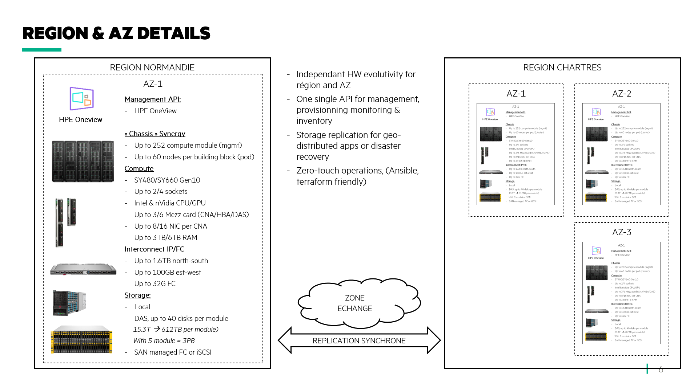

# Setting up the physical hardware
In this section, I described how to set up the physical infrastructure in order to replicate the cloud best practise using the concepts of Region, Availability Zones (AZ) and Availablity Sets (AZ).

